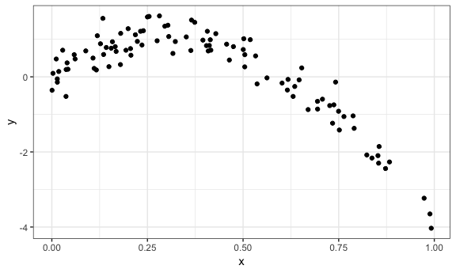
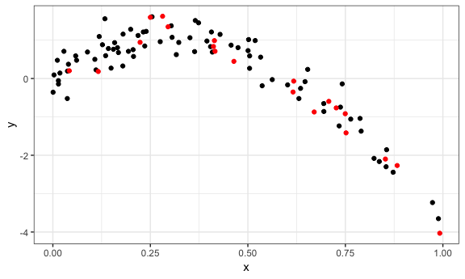
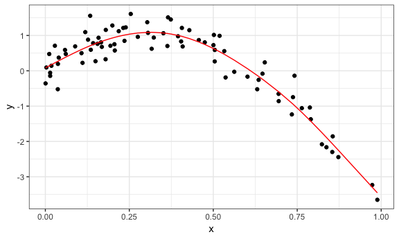
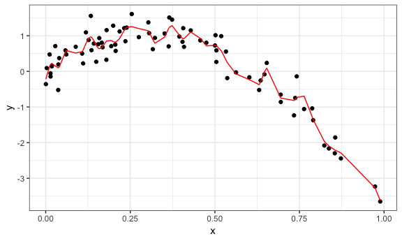
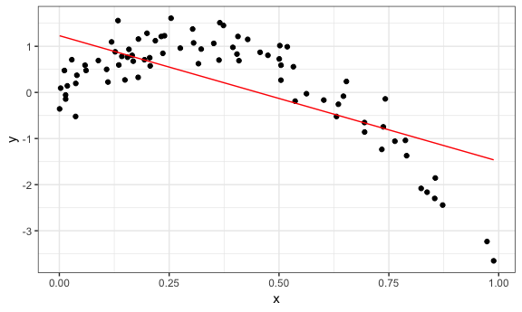
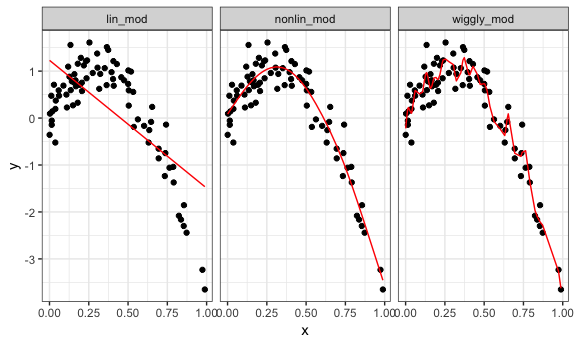
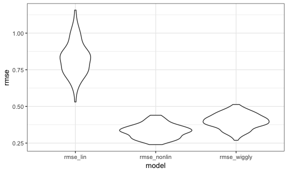
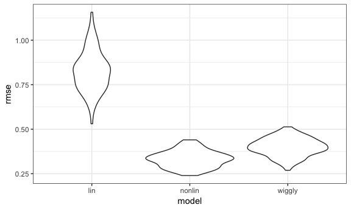
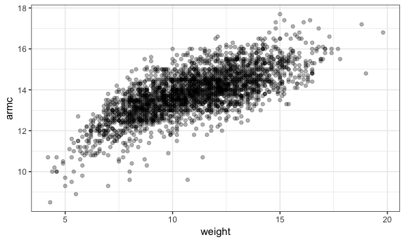
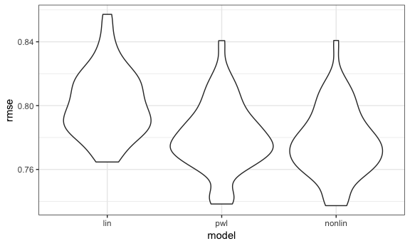

Cross Validation
================
Amin Yakubu
11/13/2018

``` r
knitr::opts_chunk$set(
  collapse = TRUE,
  fig.width = 6,
  fig.asp = .6,
  out.width = "90%"
)

library(tidyverse)
```

    ## ── Attaching packages ───────────────────────────────────────────────────────────────────────────────────────── tidyverse 1.2.1 ──

    ## ✔ ggplot2 3.0.0     ✔ purrr   0.2.5
    ## ✔ tibble  1.4.2     ✔ dplyr   0.7.6
    ## ✔ tidyr   0.8.1     ✔ stringr 1.3.1
    ## ✔ readr   1.1.1     ✔ forcats 0.3.0

    ## ── Conflicts ──────────────────────────────────────────────────────────────────────────────────────────── tidyverse_conflicts() ──
    ## ✖ dplyr::filter() masks stats::filter()
    ## ✖ dplyr::lag()    masks stats::lag()

``` r
library(modelr)
library(mgcv)
```

    ## Loading required package: nlme

    ## 
    ## Attaching package: 'nlme'

    ## The following object is masked from 'package:dplyr':
    ## 
    ##     collapse

    ## This is mgcv 1.8-25. For overview type 'help("mgcv-package")'.

``` r
theme_set(theme_bw() + theme(legend.position = "bottom"))
```

Cross validation by hand

``` r
nonlin_df = tibble(
  id = 1:100,
  x = runif(100, 0, 1),
  y = 1 - 10 * (x - .3) ^ 2 + rnorm(100, 0, .3)
)

ggplot(nonlin_df, aes(x = x, y = y)) + geom_point() + theme_bw()
```



Partition into training and testing

``` r
train_df = sample_n(nonlin_df, 80)

test_df = anti_join(nonlin_df, train_df, by = "id")

ggplot(train_df, aes(x = x, y = y)) + 
  geom_point() + 
  geom_point(data = test_df, color = "red")
```



Let's fit a few models!

``` r
lin_mod = lm(y ~ x, data = train_df)
nonlin_mod = mgcv::gam(y ~ s(x), data = train_df)
wiggly_mod = mgcv::gam(y ~ s(x, k = 30), sp = 10e-6, data = train_df)
```

This what these look like:

``` r
train_df %>% 
  add_predictions(nonlin_mod) %>% 
  ggplot(aes(x = x, y = y)) + geom_point() + 
  geom_line(aes(y = pred), color = "red")
```



``` r

train_df %>% 
  add_predictions(wiggly_mod) %>% 
  ggplot(aes(x = x, y = y)) + geom_point() + 
  geom_line(aes(y = pred), color = "red")
```



``` r

train_df %>% 
  add_predictions(lin_mod) %>% 
  ggplot(aes(x = x, y = y)) + geom_point() + 
  geom_line(aes(y = pred), color = "red")
```



Making all the plots together

``` r
train_df %>% 
  gather_predictions(lin_mod, nonlin_mod, wiggly_mod) %>% 
  mutate(model = fct_inorder(model)) %>% 
  ggplot(aes(x = x, y = y)) + 
  geom_point() + 
  geom_line(aes(y = pred), color = "red") + 
  facet_wrap(~model)
```



``` r
rmse(lin_mod, test_df)
## [1] 0.8960605
rmse(nonlin_mod, test_df)
## [1] 0.305842
rmse(wiggly_mod, test_df)
## [1] 0.3488568
```

Iteration

``` r
cv_df = crossv_mc(nonlin_df, 100)

cv_df %>% pull(train) %>% .[[5]] %>% as_tibble()
## # A tibble: 79 x 3
##       id     x      y
##    <int> <dbl>  <dbl>
##  1     1 0.194  0.708
##  2     2 0.206  0.752
##  3     3 0.409  0.689
##  4     4 0.519  0.990
##  5     5 0.788 -1.04 
##  6     6 0.602 -0.166
##  7     8 0.429  1.15 
##  8     9 0.412  0.835
##  9    10 0.973 -3.23 
## 10    11 0.734 -1.24 
## # ... with 69 more rows

cv_df =
  cv_df %>% 
  mutate(train = map(train, as_tibble),
         test = map(test, as_tibble))
```

``` r
cv_df = 
  cv_df %>% 
  mutate(lin_mod    = map(train, ~lm(y ~ x, data = .x)),
         nonlin_mod = map(train, ~mgcv::gam(y ~ s(x), data = .x)),
         wiggly_mod = map(train, ~gam(y ~ s(x, k = 30), sp = 10e-6, data = .x))) %>% 
  mutate(rmse_lin    = map2_dbl(lin_mod, test, ~rmse(model = .x, data = .y)),
         rmse_nonlin = map2_dbl(nonlin_mod, test, ~rmse(model = .x, data = .y)),
         rmse_wiggly = map2_dbl(wiggly_mod, test, ~rmse(model = .x, data = .y)))
```

summarize results

``` r
cv_df %>% 
  select(.id, starts_with("rmse")) %>% 
  gather(key = model, value = rmse, rmse_lin:rmse_wiggly) %>% 
  ggplot(aes(x = model, y = rmse)) + geom_violin()
```



``` r

cv_df %>% 
  select(starts_with("rmse")) %>% 
  gather(key = model, value = rmse) %>% 
  mutate(model = str_replace(model, "rmse_", ""),
         model = fct_inorder(model)) %>% 
  ggplot(aes(x = model, y = rmse)) + geom_violin()
```



### Child growth

``` r
child_growth = read_csv("./data/nepalese_children.csv")
## Parsed with column specification:
## cols(
##   age = col_integer(),
##   sex = col_integer(),
##   weight = col_double(),
##   height = col_double(),
##   armc = col_double()
## )
```

``` r
child_growth %>% 
  ggplot(aes(x = weight, y = armc)) +
  geom_point(alpha = .3)
```



``` r
child_growth =
  child_growth %>% 
  mutate(weight_sp = (weight > 7) * (weight - 7))
```

linear, piecewise linear, non-linear models

``` r
lin_mod = lm(armc ~ weight, data = child_growth)
pwl_mod = lm(armc ~ weight + weight_sp, data = child_growth)
nonlin_mod = gam(armc ~ s(weight), data = child_growth)
```

``` r
child_growth %>% 
  gather_predictions(lin_mod, pwl_mod, nonlin_mod) %>% 
  mutate(model = fct_inorder(model)) %>% 
  ggplot(aes(x = weight, y = armc)) + 
  geom_point(alpha = .5) +
  geom_line(aes(y = pred), color = "red") + 
  facet_grid(~model)
```


constructin training/testing splits

``` r
cv_cg_df =
  crossv_mc(child_growth, 100) %>% 
  mutate(train = map(train, as_tibble),
         test = map(test, as_tibble))
```

Let's fit models and get RMSEs

``` r
cv_cg_df = 
  cv_cg_df %>% 
  mutate(lin_mod = map(train, ~lm(armc ~ weight, data = .x)),
         pwl_mod = map(train, ~lm(armc ~ weight + weight_sp, data = .x)),
         nonlin_mod = map(train, ~gam(armc ~ s(weight), data = as_tibble(.x)))) %>% 
  mutate(rmse_lin    = map2_dbl(lin_mod, test, ~rmse(model = .x, data = .y)),
         rmse_pwl = map2_dbl(pwl_mod, test, ~rmse(model = .x, data = .y)),
         rmse_nonlin = map2_dbl(nonlin_mod, test, ~rmse(model = .x, data = .y)))
```

Finally, let's look at the results

``` r
cv_cg_df %>% 
  select(starts_with("rmse")) %>% 
  gather(key = model, value = rmse) %>% 
  mutate(model = str_replace(model, "rmse_", ""),
         model = fct_inorder(model)) %>% 
  ggplot(aes(x = model, y = rmse)) + geom_violin()
```


